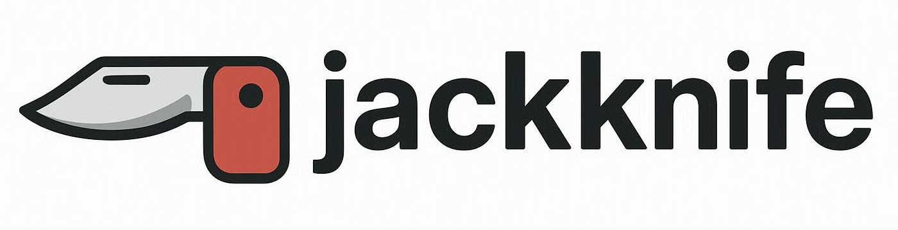

========================
Jackknife Documentation
========================

Welcome to the Jackknife documentation. Jackknife is a command-line utility that allows you to run various Python tool scripts, each within its own isolated virtual environment managed by ``uv``.

.. toctree::
   :maxdepth: 2
   :caption: Contents:

   design_philosophy
   implementation_details
   api_reference

Overview
--------

Jackknife provides a powerful way to organize and run Python tools while maintaining isolation between their dependencies. Each tool runs in its own dedicated virtual environment, eliminating "dependency hell" while still allowing for environment sharing when compatible.

Key Features
-----------

- **Isolated Environments**: Each tool runs in its own dedicated virtual environment
- **Fast Setup**: Uses ``uv`` for lightning-fast dependency installation
- **Modular Design**: Add new tools without modifying the core code
- **Easy Updates**: Update tool dependencies without affecting other tools
- **Zero Global Pollution**: No global package installations required
- **No-Boilerplate Tools**: Create tools without writing repetitive argparse code
- **Cascading Execution**: Run multiple tools in sequence with a single command
- **Environment Optimization**: Reuse compatible environments when possible to save space

Quick Links
----------

- :doc:`design_philosophy` - Learn about the core principles behind Jackknife
- :doc:`implementation_details` - Technical details of how Jackknife works
- `GitHub Repository <https://github.com/alansynn/jackknife>`_ - Source code and issue tracker

Getting Started
-------------

To get started with Jackknife, see the :doc:`../README` for installation and basic usage.

CLI Reference
-----------

.. code-block:: text

   jackknife <tool_name> [tool_arguments...]

Where:

- ``<tool_name>``: The name of the tool script (without the ``.py`` extension) in the ``tools/`` directory
- ``[tool_arguments...]``: Any arguments you want to pass directly to the tool script

For tool chaining, use:

.. code-block:: text

   jackknife "tool1[arg1 arg2],tool2[arg3 arg4],tool3"

License
------

Jackknife is released under the MIT License. See the LICENSE file for details.